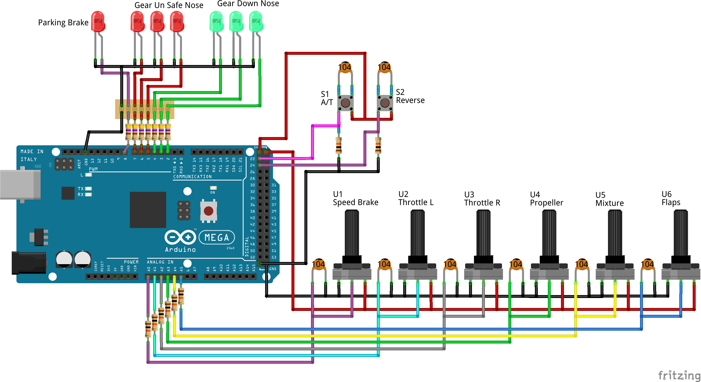
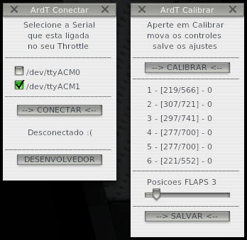
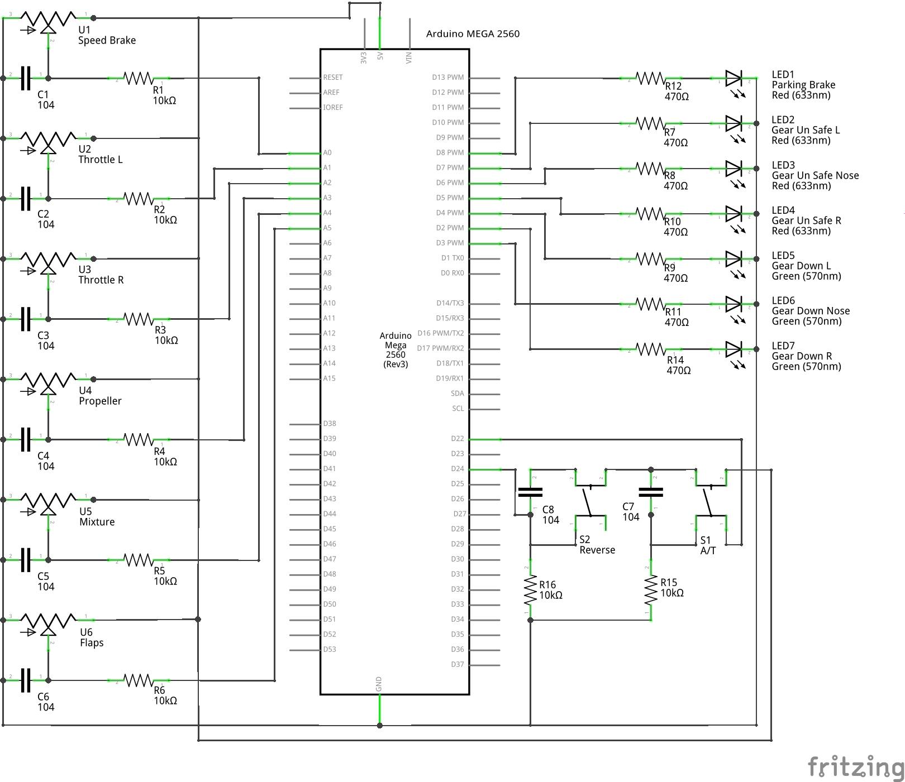

# ArdThrottle

Manetes para uso com simulador de voo X-Plane

O Equipamento foi criado por mim, Judenilson Araujo, na intensão de disponibilizar um material de fácil entendimento para criação de plugins para o X-Plane usando a linguagem Python, aproveitando as funcionalidades do projeto [PYTHON INTERFACE PLUGIN](http://www.xpluginsdk.org/python_interface.htm) do Sandy Barbour.
Bem como, a utilização da placa [Arduino](https://www.arduino.cc/) MEGA ou UNO, com a finalidade de criar um hardware para controle do simulador. Integrada com o plugin desenvolvido em python, fazendo a conexão entre hardware e simulador.

Contudo, caso ainda não tenha, você precisará instalar a versão [2.7 do Python](http://www.python.org/download/), bem como, o plugin do Sandy.

Caso queira copiar o projeto, fique a vontade. Se fizer alguma alteração no código que vai melhorá-lo, por favor, compartilhe conosco.

### Instalação do Plugin:
Faça o download do repositório para o seu computador.
Suba a skecth do arduino usando o Visual Studio Code, após criar um novo projeto usando o plugin PlatformIO.
Ou renomeie o arquivo src/main.cpp para src/main.ino e suba diretamente usando a IDE do Arduino para sua placa.
Copie o arquivo PI_ArdThottle.py para a pasta /X-Plane11/Resources/plugins/PythonScripts/
Faça as ligações no seu hardware e divirta-se!

### Utilização do Plugin:
No menu do simulador, na lista de plugin vocẽ verá o ítem:
- ArdTHROTTLE
	- Conectar
	- Calibrar
	- About

Ao clicar, serão apresentadas as seguintes janelas:

#### ArdT Conectar:
Nessa janela você verá as portas de Comunicação Serial que estão disponíveis no seu PC.
Escolha a porta que seu Throttle está ligada e clique em CONECTAR.
Em seguida abra a janela calibrar.

#### ArdT Calibrar:
Aqui você poderá calibrar seu controle, bem como, escolher quantas posições de Flap sua aeronave possui, para garantir a precisão do ajuste.
Clique em calibrar e mova o controle para o início e fim do seu curso.
Clique em salvar.
Para ajustar a quantidade de posições de Flap, você não precisa clicar em calibrar, apenas mova o ajuste na barra e clique em salvar.

Todos os ajustes serão salvos num arquivo .JSON na pasta onde o plugin se encontra.
Portanto a cada vez que você reiniciar o simulador, não será preciso fazer uma nova configuração, porém será necessário clicar em CONECTAR, na janela ArdT Conectar, para conectar o simulador ao Hardware.

### Lista do material usado:

- Arduino MEGA ou UNO;
- 4 Leds Vermelhos
- 3 Leds Verdes
- 2 botões táctil (Mini Switch);
- 8 resistores 470R;
- 8 resistores 10k;
- 8 Capacitores cerâmico de 100nF;
- A carcaça será disponibilizada para impressão em 3D.

### Esquema desenhado no [Fritzing](https://www.fritzing.org)

